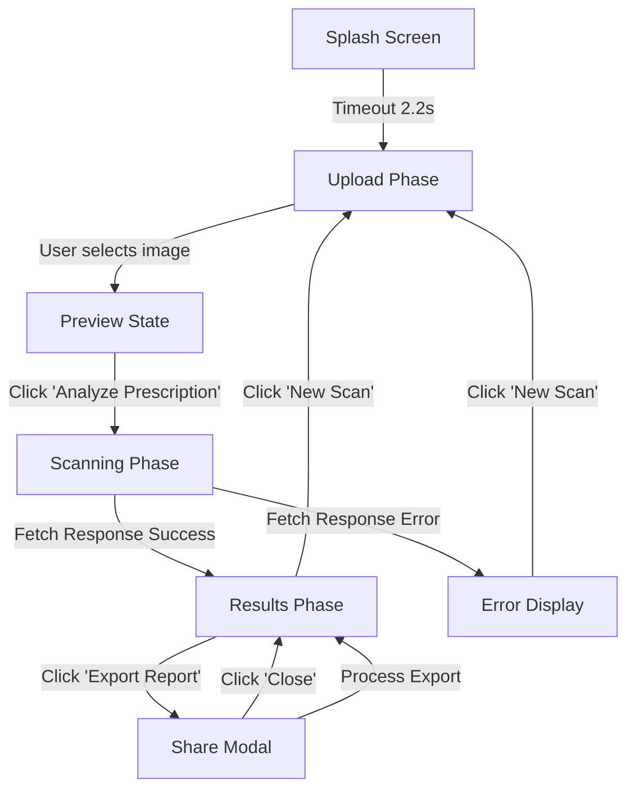
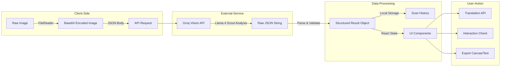

# Medical Scanner Flow Documentation

This document provides a detailed overview of the Control Flow and Data Flow within the VaidyaDrishti AI Medical Scanner application.

## High-Level Architecture

VaidyaDrishti AI is a React-based web application that uses the **Groq Vision API** (specifically the **Llama 4 Scout** model) to analyze medical prescriptions. It processes images, extracts structured information, and provides tools for interaction analysis, translation, and reporting.

---

## 1. Control Flow (UI State Transitions)

The application flow is primarily managed by the `phase` state in `PrescriptionScanner.jsx`. The phases determine which component view is rendered.

### Phase Details
- **Splash Screen**: Initial loading animation (2.2s).
- **Upload Phase**: User captures a photo or uploads an image. History is displayed here.
- **Scanning Phase**: An overlay shows the progress of the AI analysis with step-by-step animations.
- **Results Phase**: Structured data is displayed, and users can interact with medications (copy, search, translate, check interactions).
- **Share Modal**: Options for exporting as Text, PDF, or sharing to WhatsApp.

---

## 2. Data Flow (Image to Structured Report)

The data flow describes how a raw image is transformed into actionable medical information.

### Data Transformation Stages
1.  **Image Processing**: The raw image file is converted to a Base64 string to be sent in the JSON body of the API request.
2.  **AI Analysis**: The `imageBase64` is sent to Groq. The prompt explicitly requests a specific JSON format:
    - `patientName`, `doctorName`, `date`, `medications` array.
    - Each medication includes `name`, `dosage`, `frequency`, `duration`, `confidence`, etc.
3.  **Validation**: The `validateParsed` function ensures the AI's output conforms to expected types and limits string lengths to prevent UI breakage.
4.  **Enrichment**:
    - **Scheduling**: The `buildSchedule` function maps frequency strings (e.g., "thrice") to specific time slots (Morning, Afternoon, Night).
    - **Interactions**: A secondary AI call analyzes the extracted medication names for potential drug-drug interactions.
    - **Translation**: A dedicated AI call translates the entire summary into the selected regional language.

---

## 3. Technology Stack Reference

- **Frontend Framework**: React
- **Bundler**: Vite
- **Styling**: Vanilla CSS (Two themes: `PrescriptionScanner.css` and `PrescriptionScanner2.css`)
- **AI Core**: Groq API (Llama 4 Scout)
- **Utilities**:
    - `html2canvas`: For generating shareable report images.
    - `localStorage`: For persistent scan history.
    - `navigator.share`: For native mobile sharing.
